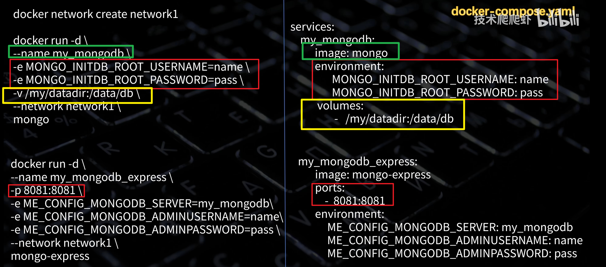

### 自我介绍重构

#### 60秒版本
```
逻辑大纲：
[综述]
1.我是谁（年限+负责系统）
2.用什么技能（熟悉技术栈）
[近况]
3.最近做过什么（最近经历+项目简述）
4.练出了什么特长（核心优势）
[补充]
5.补充亮点（AI项目经验）
6.就业愿景

专业术语对照表：
1.ToB 核心业务系统、数据平台、高吞吐数据处理链路建设
2.Spring Boot、Spring Cloud、MyBatis、MySQL、Redis、kafka消息队列、Docker 以及监控排障体系
3.多源数据同步与 NAS 落盘系统、数据库元数据管理平台
4.异步执行引擎、At-Least-Once 机制、批量刷盘和消费位点恢复、7.5T
5.落地、优化、治理
6.后端能力、大模型应用
7.后端、应用后端

---
您好，我有 5 年 Java 后端开发经验，主要负责 ToB 核心业务系统、数据平台和高吞吐数据处理链路建设。技术栈上比较熟悉 Spring Boot、Spring Cloud、MyBatis、MySQL、Redis、kafka消息队列、Docker 以及监控排障体系。（放慢语调、重读来回忆后续衔接...）

最近一段经历中，我主要负责「多源数据同步 NAS 落盘系统」、「数据库元数据管理平台」这类偏数据处理和高吞吐稳定性的项目。比如在数据落盘系统中，我负责从 0 到 1 的架构设计和核心实现，通过异步执行引擎、At-Least-Once 语义、批量刷盘和消费位点恢复，支撑日均 7.5TB 数据稳定落盘。我的优势是后端工程落地、性能优化和系统稳定性治理。（衔接...）

最近也在做 名为“拓码”的 AI 零代码应用生成平台，尝试把 Java 后端能力和大模型应用结合起来。现在希望找 Java 后端、AI 应用后端方向的岗位。


```

#### 2分钟版本
```

---
专业术语表：
- 方案设计、核心模块开发、性能优化、上线、线上问题排查等
- 分布式任务调度、高吞吐瓶颈、I/O优化、OOM飙升等问题
- 控制面和数据面分离架构、多Consumer拉取+阻塞队列缓冲+单writer模型，以及批量刷盘、先落盘后提交消费位点的机制
- 数据库资产不透明、表结构变更难追踪
- 平台设计、采集链路和版本比对能力
- 多级 MD5 摘要做层级剪枝，避免每次都全量比对字段结构
- 游标分页、只读从库路由和动态背压控制采集压力

---
您好，我有 5 年 Java 后端开发经验，主要负责 ToB 核心业务系统、数据平台和高吞吐数据处理链路建设。技术栈上比较熟悉 Spring Boot、Spring Cloud、MyBatis、MySQL、Redis、kafka消息队列、Docker 以及监控排障体系。

我最近一段经历是在赞同科技，主要负责「多源数据同步与 NAS 落盘系统」、「数据库元数据管理平台」项目。我的工作范围比较完整，从前期方案设计、核心模块开发、性能优化、部署上线、线上问题排查等都有参与。比如系统里分布式任务调度、高吞吐瓶颈、I/O优化、OOM飙升等问题，都是我重点负责或参与解决的。

我比较核心的一个项目是多源数据同步与 NAS 落盘系统。它的【背景】是公司需要把 API、数据库、Kafka 等多种来源的数据稳定写入 NAS，但【原来针对kafka类型】的「单线程消费+写入」方式在高频写入时会有吞吐瓶颈、写入抖动和可靠性问题。我在这个项目里主要【负责架构设计和核心链路改造】，通过【控制面和数据面分离、多 Consumer 拉取消费、阻塞队列缓冲、单 Writer 批量刷盘，以及先落盘后提交消费位点的机制】，最终支撑了单核 2.4万 TPS 峰值和日均 1.5TB 数据落盘。

另一个项目是数据库元数据管理系统。这个项目主要【解决】数据库资产不透明、表结构变更难追踪的问题。我【负责】平台设计、采集链路和版本比对能力，比较关键的【优化】是用多级 MD5 摘要做层级剪枝，避免每次都全量比对字段结构；同时通过【只读从库路由、动态背压以及游标分页控制采集压力】，最后支持了 500 多个数据库实例和 18.7 万张业务表接入。

我的优势主要是后端工程落地、性能优化和系统稳定性治理。
另外我最近也在做一个 AI 零代码应用生成平台，主要方向是通过自然语言生成应用，支持可视化编辑、AI 对话式修改、一键部署分享，以及用户、应用、监控这些后台管理能力。
我接下来希望找的岗位还是以 Java 后端，AI 应用后端这些方向为主。

```


### 项目口述
```
逻辑大纲：
1.项目架构
2.项目难点
3.针对方案

专业术语关键词：
- 控制面、数据面、分离架构、数据源接入、任务配置、启停和调度、数据拉取、写入
- 难点、单线程、全串行、写盘阻塞、拖累、拉取和序列化、延迟恶化、积压明显
- 自动提交、不可靠、断电或者异常恢复、数据丢失
- 任务启停和分布式调度、轮询、额外压力和响应延迟
- 写入性能、异步执行引擎、多consumer并行拉取序列化、10万级阻塞队列背压、单writer批量写入、小时窗口+尺寸兜底、本地实测、单核写峰值、37.3万、56.3万、50%、生产实测、26万、33.8万、30%、7.5TB、零积压、延迟秒级
- 可靠性、跨线程、ackQueue、先落盘后提交、at-least-once、flush()、空页缓存、提交消费位点、断电或异常恢复、文件偏移量解析、重置消费位点、数据丢失、重复消费
- 任务调度、DB定时扫表、发布订阅、任务启停、近实时响应、消除数据库轮询压力。


多源数据同步 NAS 落盘系统主要功能是采集各类型数据源数据并写入到NAS盘中。
设计上采用了控制面和数据面的分离架构。控制面负责数据源接入、任务配置、任务启停和调度；数据面负责实际数据拉取和写入。

而在项目开发过程中，需要解决几个棘手的问题：
第一是针对kafka类型的单线程"拉取-序列化-写盘"全串行架构存在性能瓶颈，消费拉取与写盘阻塞会互相拖累，在业务高峰时段消息积压明显，下游消费延迟由秒级恶化至分钟级。
第二是kafka采用自动提交策略，消费不可靠，断电或异常恢复出现数据丢失。
第三是任务启停和分布式调度如果依赖数据库轮询，会造成额外压力和响应延迟。


为此我设计了以下针对方案。
针对写入性能，我重构了异步执行引擎，采用多 Consumer 并行拉取序列化、10 万级阻塞队列背压和单 Writer 批量写入的架构，以及小时窗口滚动文件生成方式。既实现了消费拉取、写盘阻塞的异步解耦，又减少系统调用次数。
经本地实测，改造前后每条1kb数据的单核写路径峰值分别为 37.3万TPS、56.3万TPS，提升50%，生产实测改造前后单核写路径峰值分别为 26万TPS（300MB/s）、33.8万TPS（425MB/s），提升30%，最终支撑日均 7.5TB 的数据落盘，实现全天零积压，延迟稳定保持在秒级。

针对可靠性，我设计了跨线程 ackQueue 回传机制，采用“先落盘、后提交”的 At-Least-Once 语义，只有在批数据 flush排空页缓存后才提交消费位点。断电或异常恢复时，也可以通过文件偏移量解析重置消费位点，避免数据丢失和重复消费。

针对任务调度，我把原来的 DB 定时扫表改成 Redis Pub/Sub 发布订阅模型，实现任务启停的近实时响应，同时消除数据库轮询压力。
---
可能追问点：
- 为什么数据只有7.5TB：
  1）数据由少部分高峰流量（4小时）+大部分低峰流量（20小时）组成，总量不多；
  2）再进一步讲，一天内的高峰流量大概有4小时，低峰流量持续20小时，根据观察所得，高峰时段堆积的消息数量和单消息大小，可以推算出最大堆积数据量有500g左右，高峰的吞吐量可达380MB/s，低峰时段大概在30MB/s。改造后架构数据吞吐量可达425Mb/s，可完美覆盖峰值场景

- TPS 结果如何计算出来？
  通过绕过真实kafka，纯内存生成消息、每条消息固定为1kb大小，分别对 单线程架构 和 多线程架构 进行为时60s的压测得出的。
  期间通过原子计数器和ThreadMXBean分别采样消息总数和CPU占用时间得到TPS和单核CPU使用占比，验证CPU和带宽的瓶颈所在。

- 如何计算CPU使用占比？
  ThreadMXBean分别采集线程执行一秒前后CPU累加值作差值运算，结果与1s的比值即为CPU使用占比。

- 为什么本地1.5倍，生产只有1.3倍？
  本地环境瓶颈在于CPU处理数据能力，而生产环境瓶颈在于NAS盘的带宽能力。
  依据是：多消费者架构压测模型在本地环境的表现中，写线程CPU占用率始终维持在90%以上，说明绝大多数工作仍有CPU主导，几乎没有IO阻塞影响，瓶颈期仍在CPU处理能力上；而在生产环境中，TPS不仅较本地明显减少，而且写线程CPU占用率跌落到50%左右，说明CPU有一半时间在等待IO，此时瓶颈不再是CPU而是NAS带宽。因此带宽受限是生产只有1.3倍的真实原因。
  
- 阻塞队列的价值？为什么选择10万长度？
  实现「消费拉取」和「写盘阻塞」的异步解耦，不彼此拖累。
  阻塞队列主要用于写入抖动发生时，消费滞后的秒级缓冲兜底。
  10万条数据的存储大概是120MB左右，处于1g堆的合理上限内。
  

- 跨线程ackQueue回传机制实现原理？
  1）每个消费者分配一个ackQueue（无界阻塞队列）
  2）拉取的消息保留ackQueue引用
  3）将消息写入文件后，按{topic_partition,offset}的key-value方式合并最大偏移量后，再将其入队所属ackQueue
  4）最后由 consumer 完成正式提交
  
  
- 消费位点重置实现原理？
  【封装的消息体携带offset】启动时扫描当天所有文件尾部1MB【randomAccessFile.seek()】方法，得到各分区最新offset，待消费者分配完分区后，手动跳转到文件最新记录offset继续消费。

- 分区Rebalance预防？
  队列满载、消费者长时间阻塞时，超过指定时间后，消费者集体停止，触发rebalance，加剧delay现象；代码中用超时阻塞替代put，超时后把本轮拉取的消息直接扔掉，等待下轮重新拉取。  

- 幂等方案：
  上游幂等：消费位点恢复机制
  下游幂等：数据库唯一插入机制保存消息ID，后续处理前先查记录，根据查询。
  
- pub/sub的发布订阅实现原理？
  节点订阅同一个频道，触发“取消”时广播到各个节点，工作节点收到后直接匹配本地内存中的异步线程进行中断，做到了跨节点调度的0延迟和数据库0压力。


```

```
逻辑大纲：
1.解决
2.工作
3.难点
4.解决方案
---
专业术语关键词：
- 数据资产、表变更
- 设计、采集、比对
- 表数量庞多、OOM
- 采集链路、限流背压、业务库
- 版本比对、逻辑复杂、全量比对、性能、数据库压力
- OOM问题、游标分页、分批采集、差异表、释放内存、全量驻留
- 采集稳定性问题、从库路由、EMA动态背压、元数据、业务库
- 比对性能、多级MD5摘要、结构信息、上层摘要、剪枝、深层

---

	这个项目的主要功能是采集不同数据库类型的所有业务库的表名称、表字段等元数据信息，再与本地旧版本进行逐项比对并实现版本迭代。


项目最大的难点有3个：
第一是数据库表数量庞多，全量放入内存容易造成OOM。
第二是采集链路如果没有限流和背压，容易对业务库造成影响。
第三是版本比对逻辑复杂，如果每次都全量比对，性能和数据库压力都不可接受；

为了解决OOM问题，我采用“游标分页、分批采集”的流式链路，每次只查一小批元数据，处理后立即写入差异表，然后释放内存，消除了全量数据同时驻留内存的风险。

为了解决采集稳定性问题，我采用只读从库路由和 EMA 限流策略，有效避免大批量元数据拉取影响业务库。

为了解决比对性能问题，我设计了多级 MD5 摘要联动哈希比对方案，将表名称、字段、约束等不同层级的结构信息生成摘要。版本比对前先判断上层摘要是否变化，99% 无变更对象可以直接剪枝，避免深层字段逐项比较。

---
可能追问点：
- 异构数据库系统表结构不同，如何抽象定义？
  定义了元数据接口，
  统一定义了元数据接口，按表结构、字段、约束、索引几个维度划分方法，结合【策略模式】完成异构数据库表的具体实现。
  
- 异构数据库的采集源表列举几个：
  MySQL：INFORMATION_SCHEMA.TABLES、COLUMNS。。。。
  SQLServer：sys.(wbo).databases、sys.tables、sys.columns。。。
  Oracle：用户名.all_tables、用户名.dba_tab_columns
  PqSQL:库.public.information_schema.columns、table_constraints。。。
  
- 限流器的设计？
  采用guava实现限流器，每个数据源独立连接池&独立限流器。每次执行完SQL时才触发限流判断。
  按照请求错误率、连接池使用率、使用EMA算法的平均响应时间几个指标作为限流标准进行设计的，当连接池使用率>80%、平均响应时间>200ms、错误率>5% 三者满足其一就触发限流。
  
- 什么是EMA？怎么用？
  EMA指的是加权滑动平均算法，用于对波动数据加权过滤毛刺。在项目中主要用于“平均响应时间”的计算，按照 历史平均、当前响应的 8:2 权重进行分配，避免瞬时波动直接触发限流。
  
- 多级MD5摘要的具体实现？仅改变注释、字段顺序是否会触发变更？
  1.依次拼接表结构、字段、约束、索引类型的名称、类型、长度、默认值等核心字段；
  2.注释不纳入检测范围、拼接字符串前会先指定规则排序，消除字段顺序变更的影响。
```

### java 高频主题

#### Spring 事务 + MySQL 事务一致性

[Spring 事务与 MySQL 事务 记忆骨架](../03%20-%20Areas/Spring%20事务与%20MySQL%20事务%20记忆骨架.md)

**🔴【一、Spring事务】**
1.Spring 事务的本质？AOP框架生成的代理对象，会对添加了@Transactional注解的方法执行前后，分别执行开启/提交事务的操作，并在方法返回异常时回滚事务。调用链【调用代理对象 -> 调用事务拦截器 -> 开启事务 -> 执行业务方法 ->根据方法结果提交事务或者回滚】

2.@Transactional的核心属性：事务传播特性（propagation）、事务隔离级别（isolation）、回滚触发异常（rollbackFor）
	1）事务传播特性：REQUIRED(默认、最多只有一个当前事务)、REQUIRES_NEW（每次新建事务，提交方式是先内后外）
	2）事务隔离级别：
	读未提交(ru)——读到别人未提交事务的数据
	读已提交(rc)——读到别人已提交事务的数据
	可重复读(rr)——只读到老数据、多/少出来的数据
	串行化(s)
	3）异常回滚机制：只针对Error与RuntimeException，其他异常抛出时需转化为RuntimeException 或在RollbackFor注明Exception.class
	
3.Spring事务失效场景
1）同类方法被内部调用=>本质是this.method(),没有经过代理对象
2）方法非public
3）类没有被Spring管理，自创建
4）异常被吞
5）异常类型不匹配（非Error、RuntimeException）


**🔴【二、MySQL事务】**
1.事务特性：ACID
	1）A（原子性）：所有事务要么全部成功，要么全部失败
	2）C（一致性）：事务执行前后数据逻辑要一致
	3）I（隔离性）：多个事务之间彼此独立互不干涉
	4）D（持久性）：事务提交后数据持久保存
底层逻辑：原子性由 undolog（撤）保证；隔离性由MVCC和锁保证；一致性由业务逻辑和数据库约束保证；持久性由 redolog（补）保证；

>**PS:不要从“redo = 重做什么操作”开始记，而要从“崩溃后数据库结果是什么”开始记**

2.redolog与undolog：
	1）redolog：
	**定义**：预写日志，负责先写日志再刷盘
	**背景**：数据持久化+减少高频随机IO -> buffer缓冲区 -> 宕机时缓冲区数据丢失 -> redolog预写兜底
	**流程**：将数据 `修改/新增`操作通过追加方式写入日志文件，再将内存脏页刷入磁盘数据文件；数据崩溃恢复时，通过重放redo日志完成复原。
	2）undolog：
	**定义**：回滚日志，保存数据修改前原始信息
	**流程**：执行数据修改时记录变更前的数据，事务回滚时读取本事务私有 undolog链表，按执行逆序回放；MVCC时则根据roll_pointer读取版本链返回数据。

3.MySQL隔离级别：
	1）读未提交：存在脏读、不可重复读、幻读
	2）读已提交：存在不可重复读、幻读 【oracle默认级别】
	3）可重复读：存在幻读 【MySQL 默认级别】
	4）串行化：存在执行效率低

4.MVCC（多版本并发控制）
	1）目的：解决 "读-写"【并发】
	2）组成部分：undolog+readView
		判断规则——readView（进行时、未来事务不可见；本身、过去事务均可见）
		历史数据展示——undolog（记录历史行数据，形成版本链表）
	3）readView
		定义：记录当下事务状态的快照。
		目的：判断数据行可不可见。
		内容：（每次生成时都会校准）
			a.下个事务id (m_low_limit_id)：
			b.进行时事务集合 (m_ids)
			c.进行时最小事务id (m_up_limit_id)
			d.自己事务id(creator_trx_id)：默认为0，执行过 `update/insert`语句后才会被赋值
	4）与隔离级别的关系：
		a.读未提交：不生成readView，直接读取最新数据，故能读取未提交数据
		b.读已提交：每次查询都生成readView：只能读取本身+已提交的数据（本身事务可见、过去事务可见）
		c.可重复读：首次查询才生成readView：快照生成时只能读取本身+老数据；且由于只生成一次快照，看不到后续提交事务的修改数据，故可避免「不可重复读」和「幻读」
	5）幻读的消除原理：快照读只保留旧数据，消除变化影响。
	
```
MVCC的执行过程

最新行数据（聚簇索引页 trx_id=105）
        ↑
undo版本3(trx_id=104) <──┐  （值变更所持有的事务id）
        ↑                 │
undo版本2(trx_id=102)     │  undo‑log版本链表
        ↑                 │
undo版本1(trx_id=100) <───┘

ReadView（创建时固定4个参数）
 m_ids:[100,102]       活跃事务集合
 m_low_limit_id = 106  max_trx_id
 creator_trx_id=103
```

5.快照读与当前读
	1）快照读：通过MVCC读取历史版本，“不加锁”。幻读解决手段：MVCC（防旧数据变）
	2）当前读：读取最新数据，可能加锁。幻读解决手段：行锁+间隙锁（防新数据进）
		a.select..... for update (X锁)
		b.select..... lock in share mode （S锁，读改情况下容易出现死锁）

6.MySQL锁机制：
	0）行锁的释放时机由事务控制，事务没有提交，锁不会释放
	1）锁功能：读锁/写锁
	2）锁范围：行锁、间隙锁、临键锁、表锁；功能与范围是交叉关系——读/写锁读可作用在行、间隙、临键范围上。
	3）行锁：
		a.锁定对象：索引行
		b.特点：粒度最小、并发最高
	4）间隙锁：
		a.锁定对象:索引行与行之间的空白区间
		b.特点：解决当前读的幻读问题
		c.案例：现有数据 1、2、4，执行 `where id>1 and id<3`，锁定间隙：(2,4)；`原理：区间右侧找第一条不满足条件的真实索引值,即4，区间左侧能通过条件找到值，则选该值，否则选where条件左侧值`
	5）临键锁：
		a.行锁+间隙锁的组合
		b.特点：左开右闭
	6）表锁：
		a.整张表，并发极低
		b.特点：索引失效时由行表退化所得/主动执行 lock table
	7）死锁出现的因素：
		a.事务边界：决定锁持有多久
		b.索引好坏：决定锁范围大小
		c.上锁顺序：决定是否形成环路等待

#### Redis缓存一致性

[Redis缓存一致性记忆骨架](../03%20-%20Areas/Redis缓存一致性记忆骨架.md)

**🔴什么是缓存一致性：** 数据库和redis缓存双写带来的问题。

数据库和Redis是相互独立的资源，无法天然保证同时成功或失败。因此会基于业务一致性的要求选择方案，大部分场景下追求「最终一致性」的结果，方案上也会选择删除缓存、重试、消息补偿、binlog订阅和TTL兜底等。

**🔴不一致现象**:（三大归因）
1. 双操作非原子性：
	1. 更新 DB 成功，删缓存失败（库改了、缓存旧）
	2. 删缓存成功，更新 DB 失败（缓存空 / 删了、库没变，后续加载旧数据进缓存）
2. 多请求并发时序紊乱：（旧值晚于新值写入缓存）
	1. 「并发读写」导致旧数据重新写入缓存（请求A缓存过期查询DB->回填缓存过程中，请求B先执行 更新DB->删除缓存）
3. 缓存失效链路不可靠：
	1. 多级缓存中，本地缓存没有及时失效。
	2. MQ 或 binlog 延迟导致缓存失效不及时。
	3. 网络抖动、Redis 故障导致没有及时失效。

**🔴 旁路缓存(Cache Aside)逻辑**
- 定义：数据库作为事实数据源，由应用代码控制缓存读写
- 读流程：
- ```
  先查缓存 -> 
  缓存命中，直接返回. -> 
  缓存未命，查数据库 -> 
  把数据库结果写入缓存 -> 
  返回结果
  ```
- 写流程：
- ```
  先更新数据库，再删除缓存
  ```

**🔴 「先更后删」 VS 「先删后更」**：

>问题复现本质：先删除缓存，再回填旧值

- 先删后更典型问题：删除缓存后、更新DB前 另一个请求回填缓存旧值
- ```
  线程A：【删除缓存】
  线程B：              查询缓存
  线程B：              查询DB
  线程B：              【回填缓存旧值】
  线程A：更新DB
  ```
- 先更后删典型问题：
- ```
  现象1：删除缓存失败
  现象2：请求A缓存过期查询DB->回填缓存过程中，请求B先执行 更新DB->删除缓存 【V(读SQL)<V(写SQL) 发生概率不高】
  
  线程A：查询DB
  线程B：             更新DB
  线程B：             【删除缓存】
  线程A：【回填缓存旧值】 
  
  
  但总体发生概率比「先删后更」更低
  ```


**🔴缓存一致性方案**

- 单删（先更新后删除）
- 延迟双删
- MQ 异步补偿删缓存
- Canal Binlog+MQ补偿删缓存

1. 局限：无法保证强一致性：所有方案都存在**毫秒级短暂窗口**（DB与Redis非原子性导致的间隙），必须容忍毫秒级窗口内，更新后瞬间读到旧数据。

2. 核心目的：优化「**极端情况下回填脏数据**」的最长存活时间以及「**删除缓存**」的可靠性


| 方案                 | 瞬时读写竞态窗口（更新 DB→删缓存间隙） | 删除缓存方式                                       | 并发回填脏数据最长存活上限 | 删缓存可靠性        |
| ------------------ | --------------------- | -------------------------------------------- | ------------- | ------------- |
| 单删（基础 Cache Aside） | ≤50ms                 | 更新完DB后删除缓存，删除失败后同步重试                         | 分钟级（TTL 兜底）   | 极低，失败长期脏读     |
| 同步延迟双删             | ≤50ms                 | 同步sleep500ms~1s后，执行第二次删除                     | 500ms~1s      | 中等，sleep 阻塞线程 |
| MQ 异步删缓存           | ≤50ms                 | 更新完DB后执行redis删除，投递MQ延迟消息，消费者接收后执行删除redis缓存   | 200ms~2s      | 高，消息重试不丢失     |
| Canal Binlog+MQ    | ≤50ms                 | canal抓取db变更记录，解析后发送MQ消息，消费者接收后执行删除/更新redis缓存 | 100ms~800ms   | 极高，全渠道变更兜底    |

3. 一致性方案应用场景：

**纯 Redis**

| 业务特征                                      | 推荐方案              |
| ----------------------------------------- | ----------------- |
| 单体后台、QPS 低、仅单入口改库、更新极少                    | 单删（更新 DB 后一次 DEL） |
| 中小型分布式、中等写并发、可接受 秒级 阻塞                    | 同步延迟双删            |
| 中小型分布式、中等写并发、可靠性、异步解耦                     | MQ 异步删缓存          |
| 大型分布式、高并发、可靠性、多渠道改库（后台 / DBA 脚本）、更少依赖业务代码 | Canal Binlog + MQ |

**Caffeine+Redis 多级缓存（超高读热点）**

| 业务特征                   | 推荐本地缓存失效方案                            |
| ---------------------- | ------------------------------------- |
| 几乎不更新、集群节点少、追求最简架构     | 仅靠 Caffeine 3~10s TTL 自动过期            |
| 几十台实例、无现成 MQ、需要快速清本地缓存 | Redis Pub/Sub 广播失效                    |
| 上百实例、高并发、需要消息重试不丢消息    | MQ 全局广播清理两级缓存                         |
| 多渠道改库、大型中台 / 金融业务      | Canal Binlog + MQ 统一清理 Redis+Caffeine |


**🔴 删除缓存失败策略**

1. TTL兜底：给缓存设置合理过期时间，作为最终兜底使用
2. 同步重试：失败后立即重试几次，但redis不可用时作用有限
3. 异步MQ重试：消费者异步重试删除，需注意保证「消息消费幂等」（查->删）
4. binlog订阅：

```
   业务更新数据库
	↓
	Canal / Debezium 监听 binlog
	↓
	识别变更表和主键
	↓
	删除或更新对应缓存
```


**🔴 延迟双删（读写并发导致旧数回填的应对）**

```
通过延迟第二次删除，把并发读请求写回的旧缓存再清理一次。但延迟时间不好确定，所以我一般把它作为补偿手段，而不是首选强一致方案。
```


**🔴缓存击穿、穿透、雪崩**

1. 缓存穿透：
	1. **定义**：查询数据库本身不存在的值，缓存也没有，让每次请求都打到数据库中
	2. **解决方案**：
		1. 参数校验：保证合法性
		2. 缓存空值：缓存一个TTL极短的空标记
		3. 布隆过滤器：不保证一定存在，但保证一定不存在
		4. 限流和风控：请求次数
	3. **面试回答**：缓存穿透我一般会从参数校验、缓存空值和布隆过滤器三层处理。对于普通不存在数据，可以缓存空值并设置短 TTL；对于恶意高频不存在请求，可以用布隆过滤器提前拦截，避免请求打到数据库。
2. 缓存击穿：
	1. **定义**：某个热点key过期瞬间，大量并发请求同时打到数据库
	2. **解决方案**：
		1. 分布式锁重建缓存
		2. ```
		   缓存未命中
			↓
			尝试获取锁
			↓
			获取锁的线程查 DB 并重建缓存
			↓
			其他线程等待、短暂 sleep 后重试，或返回旧值
		   ```
		3. 热点key逻辑过期，后台异步刷新
		4. ```
		   缓存中保存数据和逻辑过期时间。
		   ↓
		   每次获取缓存时检查逻辑过期时间
		   ↓
		   即将过期，驱动异步线程刷新缓存
		   ↓
			即使逻辑过期，先返回旧值。
		   ```
	3. **面试回答**：缓存击穿通常发生在热点 Key 过期瞬间。我的处理思路是热点 Key 要么设置逻辑过期，由后台异步刷新；要么用分布式锁控制只有一个线程重建缓存，其他线程等待或返回旧值，避免所有请求同时打到数据库。
3. 缓存雪崩：
	1. **定义**：大量 Key 在同一时间过期，或者 Redis 整体不可用，导致大量请求直接打到数据库。
	2. **解决方案**：
		1.  TTL 加随机值，避免同一时间过期。
		2. Redis 高可用：哨兵 / 集群
	3. **面试回答**：缓存雪崩可以从两个方向处理。如果是大量 Key 同时过期，可以给 TTL 加随机偏移。如果是 Redis 整体不可用，需要依赖 Redis 高可用、本地缓存兜底、限流熔断和降级策略，避免数据库被瞬间打垮。

🔴**多级缓存一致性：Caffeine + Redis**

- **常见结构**
```
本地缓存 Caffeine
↓
分布式缓存 Redis
↓
数据库 MySQL
```

- **读流程**：
```
先查 Caffeine
未命中查 Redis
Redis 未命中查数据库
回写 Redis
回写 Caffeine
```


- **一致性风险**
```
1. Redis 删除了，但各应用节点 Caffeine 还保留旧值。
2. 某个节点更新数据后，其他节点本地缓存没有失效。
3. 本地缓存 TTL 太长导致旧数据滞留。
4. 多节点之间缓存失效通知丢失。
```


- **解决方案**
```
1.使用中间件实现本地缓存失效（MQ/redis 发布订阅模型）
2.本地缓存设置极短过期时间(兜底)
```

- **面试描述**：
```
如果只是低风险缓存失效通知，Redis Pub/Sub 足够简单；如果缓存一致性要求更高，或者失效事件不能丢，我会更倾向用 MQ，因为它有确认、重试和消费失败处理。
```


#### MQ可靠性与幂等 

[MQ 可靠性记忆骨架](../03%20-%20Areas/MQ%20可靠性记忆骨架.md)

**🔴MQ三类可靠性问题

- 生产者可靠发送 
```
【本质】：数据库事务与MQ消息的操作为 「非原子性操作」

【问题现象】：
1.业务数据写入成功了，但消息没发出去 （入库成功，消息失败）
2.消息发出去了，但业务数据没提交 （入库失败，消息成功）
3.消息发出去了，但生产者不知道是否成功 （消息状态）

【常见方案】：
「方案1」：失败后记录日志，定时扫描补偿；
缺陷：
现象1部分解决：正常情况下通过日志可完成兜底重发。出现宕机仍会出现丢失问题。
现象2完美解决：顺序固定：事务先提交成功，再执行MQ写入
现象3无法解决：只记录发送失败的消息；出现宕机时发送失败仍会出现丢失问题。


1. 开启本地事务
2. 写入业务表
3. 提交本地事务
4. 写MQ（@Transactional之外）
5. 失败后记录日志
6. 定时任务重发
   

「方案2」：MQ事务消息（仅RocketMQ支持）

1.生产者发送半消息给MQ服务器；
2.返回响应后生产者执行本地数据库事务
3.根据本地事务结果——
	成功：生产者commit；消费者消费消息；
	回滚：MQ删除半消息；
	中断/宕机：MQ服务端定时回查本地事务状态决定提交/丢弃

「方案3」：本地消息表；（通用性最强）
核心优势：消息与业务同事务，为原子操作
缺陷：仍然存在一致性问题，即第6、7步骤仍然是非原子性，矛盾从消息丢失转移为消息重复消费问题。

现象1、2完美解决：本地与消息同事务，原子性操作
现象3完美解决：消息表记录消息完整发送状态（待发送、成功、失败），生产者依托数据库状态全程可见

1. 开启本地数据库事务
2. 写业务表
3. 写本地消息表 outbox_message
4. 提交事务
5. 后台任务扫描 outbox_message
6. 发送 MQ
7. 发送成功后标记消息状态为 SENT
8. 失败则重试

```

```SQL
-- 本地消息表内容
-- 内容解构：
-- 1.幂等的唯一标识符
-- 2.业务消息体——模块、内容
-- 3.MQ路由域——所属topic
-- 4.消息状态域——发送状态、重试次数
-- 5.审计字段——创建和更新时间
CREATE TABLE outbox_message (
    id BIGINT PRIMARY KEY,                -- 物理主键，无业务意义
    message_id VARCHAR(64) NOT NULL UNIQUE,-- 全局唯一消息ID（幂等核心）
    aggregate_type VARCHAR(64) NOT NULL,  -- 业务模块（如：order、user）
    aggregate_id VARCHAR(64) NOT NULL,    -- 业务ID（订单号、用户ID）
    topic VARCHAR(128) NOT NULL,           -- MQ Topic
    payload JSON NOT NULL,                 -- 消息内容（JSON格式最佳）
    status VARCHAR(32) NOT NULL,           -- 消息状态（PENDING、SENT）
    retry_count INT NOT NULL DEFAULT 0,    -- 重试次数
    next_retry_time DATETIME NOT NULL,     -- 下次重试时间（实现指数退避）
    created_at DATETIME NOT NULL,          -- 创建时间
    updated_at DATETIME NOT NULL           -- 更新时间
);
```

- Broker可靠存储
```
【解决问题】：
1.消息是否持久化
2.Broker 宕机是否丢消息
3.主从复制是否可靠
4.消息是否已经刷盘


```

- 消费者可靠消费
```
【问题现象】：
1.业务未完成，消费者宕机
2.业务处理成功，ACK失败
3.重复消费

【基本原则】：手动ACK、且先处理业务，后确认消息、业务幂等

【消息语义】：
最多一次（At Most Once）：先ACK，再处理业务 -> 消息最多被消费一次，不会重复，会丢消息
至少一次（At Least Once）：先处理业务，再ACK-> 消息最少被消费一次，会重复，不丢消息
恰好一次（Exactly Once）：单MQ做不到，需要结合业务幂等实现

```

**🔴 幂等性**
- 定义：同一条消息消费一次和消费多次，对业务结果的影响一致
- 例子：
```
订单状态从 CREATED 改为 PAID
如果订单已经 PAID，则直接返回成功

根据唯一流水号扣款
如果流水号已处理，则不重复扣款

插入消费记录
如果 message_id 已存在，则跳过业务执行
```


**🔴 幂等设计方案**

- **方案1：唯一业务单号去重；** 
```java

核心思想：添加数据库唯一约束，并依赖唯一键捕获冲突
@Transactional
public void consume(PaymentMessage message) {
    try {
        paymentRecordRepository.insert(message.paymentNo(), message.orderId(), message.amount());
    } catch (DuplicateKeyException duplicate) {
        return;
    }

    orderRepository.markPaid(message.orderId());
}
```

- **方案2：状态机幂等**
```sql
-- 核心思想：只允许状态从合法前置状态流转到目标状态

UPDATE orders
SET status = 'PAID',
    paid_at = NOW()
WHERE id = ?
  AND status = 'CREATED';
```

```java

@Transactional
public void markPaid(Long orderId, String paymentNo) {
    int updated = orderRepository.markPaidIfCreated(orderId, paymentNo);

    if (updated == 0) {
        Order order = orderRepository.findById(orderId)
                .orElseThrow();

        if (order.isPaid()) {
            return;
        }

        throw new IllegalStateException("Order is not payable: " + order.status());
    }
}
```


**🔴 消息顺序性**
- 现象：生产者默认 **轮询发送** 到不同队列（分区），全局完全无法保证顺序，只保证同一个队列内有序。
- 方案：
```
生产者：同一业务 key 发送到同一队列或同一分区
消费者：单线程或局部串行处理
```


**🔴 经典面试题**

**问题 1：如何保证 MQ 消息不丢失？**

```
我会从三段链路保证。
生产者端开启发送确认，发送失败重试，核心业务使用事务消息或本地消息表保证业务数据和消息记录一致。

Broker 端开启消息持久化、副本或主从复制，并根据业务重要性选择同步刷盘或同步复制。

消费者端关闭自动确认，业务处理成功后再 ACK，失败走有限重试和死信队列。最后还要有补偿任务、消息轨迹、监控告警和业务对账，因为只靠 MQ 配置不能覆盖所有异常场景。
```

**问题2：如何解决重复消费**

```
我的处理方式是消费端幂等。
具体可以用业务唯一号，例如 payment_no、order_no、refund_no 建唯一索引。
状态型业务用状态机幂等，比如只允许订单从 CREATED 更新到 PAID。
```

**问题 3：MQ 能不能保证 exactly-once？**

```
单纯靠 MQ 很难保证端到端 exactly-once。
MQ 可以提供至少一次、最多一次。
exactly-once 必须由业务幂等、事务边界、去重表、状态机和补偿机制共同保证。工程上更常见的目标是“至少一次投递 + 消费端幂等”，实现业务结果上的只执行一次。
```

**问题 4：如何保证订单创建后一定发送 MQ？**

```
可以用事务消息或本地消息表。如果用本地消息表，创建订单和插入 outbox_message 在同一个数据库事务中完成。事务提交后，由后台任务扫描待发送消息并投递 MQ，发送成功后标记为 SENT，失败则重试。这样可以避免订单创建成功但消息完全没有记录的问题。消费者侧仍然需要幂等，因为补偿任务可能导致重复发送。
```

#### JVM内存模型、GC与线上OOM排查

[JVM&GC&OOM排查记忆骨架](../03%20-%20Areas/JVM&GC&OOM排查记忆骨架.md)

🔴 **全局认知：**
- **JVM内存管理主要解决2个问题：对象分配到哪里，以及对象不再使用后如何回收；**
- **GC负责回收堆和元空间的无用对象；**
- **线上OOM排查本质上是判断哪块内存耗尽、为什么耗尽，以及如何通过GC 日志、dump和监控验证结论。**

**🔴JVM运行时内存区域**


| 区域      | 线程私有 | 存放内容                                       | 常见异常                         |
| ------- | ---- | ------------------------------------------ | ---------------------------- |
| 程序计数器   | 是    | 线程执行的下条字节码指令                               | 无OOM                         |
| 虚拟机栈    | 是    | 栈帧、局部变量、操作数栈、动态链接                          | StackOverFlow Exception      |
| 本地方法栈   | 是    | Native 方法调用                                | native相关错误                   |
| 堆       | 否    | 对象实例、数组                                    | OutOfMemory Error            |
| 方法区/元空间 | 否    | 类元信息（类完整名称、修饰符、字段表、方法表）、运行时常量池、静态变量（1.7前）等 | OutOfMemory Error：Meta Space |

**🔴堆内存结构：分代模型**

```
Heap
├── Young Generation
│   ├── Eden
│   ├── Survivor 0
│   └── Survivor 1
└── Old Generation
```

**🔴 对象分配过程**

```
1.类加载检查（加载->验证->准备->解析->初始化）【载入jvm；验证规范；分配内存、零值；符号引用变直接引用；静态变量赋值+静态代码块】
2.分配内存（根据[对象头、实例数据、对齐填充]确定内存大小，通过指针碰撞/空闲列表分配堆内存）
3.设置对象零值（属性赋默认值）
4.设置对象头（哈希值、分代年龄、锁标记、数组长度等）
5.执行初始化代码（程序员编写）
6.返回对象引用

```

**🔴 对象在堆中的流转和回收过程**

```
1.新对象优先分配到Eden区
2.Eden区空间不足触发Minor GC
3.存活对象进入到 Survivor区
4.多轮存活的对象晋升到 Old区
5.大对象直接进入到 Old区
6.Old空间不足或者晋升失败可能会触发 Full GC
```

**🔴「JVM运行时区域 」VS 「JMM（Java Memory Model）内存模型」**

**一句话区分**：jvm运行时区域=>「对象存储问题」。JMM内存模型=>「多线程读写共享变量」

**核心概念：**

```
主内存：共享变量所在位置
工作内存：线程自己的变量副本

线程之间不能直接访问彼此的工作内存，变量修改需要通过主内存完成同步
```

**JMM解决问题：**

- 原子性
- 可见性
- 有序性

**机制：**
- volatile：可见性、有序性
- synchronized：原子性、可见性、有序性

**🔴对象内存布局**

- 对象头：保证能被JVM识别（hashcode、年龄、锁状态）
- 实例数据：保证能存储业务数据
- 对齐填充：让CPU更快读取


**🔴GC对象回收**

**依据：可达性分析**

```
从 GC Root出发能到达的对象则认为「对象存活」；不可到达的对象则认为「待回收」
```

**GC Root类型**

- 局部变量
- 静态变量
- 常量
- 活跃线程对象

**可达的引用类型**

- 强引用：
	- `Object obj = new Object()` 
	- 常规对象引用，可达不回收
- 软引用：
	- `SoftReference<Object> ref = new SoftReference<>(new Object())`
	- 内存不够才回收
- 弱引用：
	- `WeakReference<Object> ref = new WeakReference<>(new Object());`
	- 只要GC即回收
- 虚引用：
	- 拿不到对象，用于监听释放

**🔴GC 算法**

- 标记-复制算法
	- 定义：存活对象被复制到另一个空间
	- 缺陷：空间使用翻倍
- 标记-清除算法
	- 定义：标记的对象被直接清除
	- 缺陷：内存碎片
- 标记-整理算法
	- 定义：存活的对象被移到一边
	- 缺陷：操作复杂、成本高
- 分代收集算法
	- 定义：不同区域使用不同算法
	- 年轻代：标记-复制算法
	- 老年代：标记-整理（压缩）算法/标记-清除算法
	- 缺陷：需要处理跨代引用


**🔴GC 收集器**

- Serial GC 系列（Serial + Serial Old）
	- 特点：单线程
	- 年轻代 GC：Serial
	- 老年代 GC：Serial Old
	- 参数：`-XX:+UseSerialGC`
- Parallel GC 系列（Parallel Scavenge +Parallel Old ）
	- 特点：吞吐量
	- 年轻代 GC：Parallel Scavenge
	- 老年代 GC：Parallel Old
	- 参数：`-XX:+UseParallelGC`
- CMS GC
	- 特点：并发标记清除、停顿短；内存碎片、浮动垃圾
	- 性质：**老年代 GC**
	- GC过程：
		1. 初始标记：(找GCRoot、stw)
		2. 并发标记：(找所有存活对象、不卡业务)
		3. 重新标记:（找新增存活对象、stw）
		4. 并发清除：（清理垃圾）
	- **并发失败**：FullGC 后腾不出足够的空间给存活对象，serial Old兜底，全堆GC，STW时间更长，性能退化，卡顿严重（serial old 兜底）
	- 缺陷：
		- 只回收老年代，采用【标记 - 清除】算法，不整理内存、会产生碎片（清除不干净）
		- 触发时机晚，达到70%才并发回收，预留空间小（触发时机晚）
		- 持续加压，内存碎片和晋升大对象持续挤占空间
- G1 GC
	- 特点：大堆管理、分区、无碎片、停顿可控。
	- 性质：整堆GC
	- 优化：
		- 分区：按逻辑分代（贴标签区分，不再物理划分）切割成若干小区域；，每类分配不同内存，多回收新生代，少回收老年代，提升回收效率；
		- 无碎片：微观各分代统一采用 标记-复制算法对数据进行迁移整理。
		- 停顿可控：局部（分区）增量回收，更快响应。
	- GC过程：
		1. 初始标记：(stw)
		2. 并发标记：(不卡业务)
		3. 重新标记:（stw）
		4. Mixed GC 复制回收（新生+老年代 ）


**垃圾收集器搭配**

```
新生代收集器        可搭配的老年代收集器
--------------------------------------------------
Serial          →  Serial Old、CMS
ParNew          →  Serial Old、CMS
Parallel Scavenge →  Parallel Old
G1              →  自己管新老年代（不需要搭配）
```

**🔴 GC日志与核心指标**

GC 日志配置

```bash
# JAVA9
# 记录所有gc、安全点日志
# 输出到文件gc.log
# 打印内容：真实时间、JVM启动了多久、日志级别、日志标签
# 滚动切割大小、最多保留文件个数

-Xlog:gc*,safepoint:file=/logs/gc.log:time,uptime,level,tags:filecount=10,filesize=100M

# JAVA8
# 打印GC详细信息
# 打印GC发生时间
# 打印对象年龄分布
-XX:+PrintGCDetails
-XX:+PrintGCDateStamps
-XX:+PrintTenuringDistribution
-Xloggc:/logs/gc.log
```

关注点： [GC日志指标指导](../03%20-%20Areas/GC日志指标指导.md)

简化方法论（事后分析）：
- 业务问题是否与GC时间和GC频率有关。
- 问题产生时FullGC的原因、耗时。
- 回收前后内存和 Old 区趋势判断是否积压。

**🔴OOM类型与可能原因**

1. 堆OOM`java.lang.OutOfMemoryError: Java heap space`

| 原因    | 示例                  |
| ----- | ------------------- |
| 内存泄漏  | 集合、缓存无上限            |
| 大对象   | 一次性加载大文件、大List、大Map |
| 流量激增  | 请求堆积、批量任务过大         |
| 堆设置太小 | -Xmx不合理             |

---
2. Metaspace OOM

| 原因          | 示例                      |
| ----------- | ----------------------- |
| 动态生成类太多     | CGLIB                   |
| 类加载器泄露      | 热部署、插件化                 |
| Metaspace太小 | -XX:MaxMetaspaceSize 太小 |

---
3. StackOverflowError


| 原因         | 示例     |
| ---------- | ------ |
| 栈帧太多（无限递归） | 方法互相调用 |
| 栈帧太大       | 大量局部变量 |

---
**🔴 线上OOM排查标准流程**

1. 先恢复服务

| 场景          | 动作    |
| ----------- | ----- |
| 单实例异常       | 摘除流量  |
| 流量激增        | 限流/降级 |
| 服务不可用且有dump | 重启应用  |
| 新版本泄露       | 回滚版本  |


2. 确认OOM类型

```
Java heap space
GC overhead limit exceeded
Metaspace
```

3. 分析GC日志（动态过程，了解趋势）

[GC日志指标指导](../03%20-%20Areas/GC日志指标指导.md)

4. 分析DUMP日志（静态瞬间，定位）

- MAT 分析路径：
	1. 打开 heap dump
	2. 看 Leak Suspects （**快速定位疑似泄露**）
	3. 看 Dominator Tree （**看谁占用最多内存**）
	4. 按 Retained Heap 排序 （**对象释放后可释放内存**）
	5. 找最大对象 
	6. 查看 Path to GC Roots （**为什么对象没被释放**）
	7. 判断是谁持有引用
	8. 改代码


🔴 **OOM 排查案例**

1. Java Heap OOM

```
有一次服务出现 Java heap space。我首先确认 JVM 已经配置了 HeapDumpOnOutOfMemoryError，保留了 heap dump 和 GC 日志。GC 日志显示 OOM 前 Full GC 非常频繁，而且 Full GC 后 Old 区几乎不下降，说明不是单纯堆太小，而是大量对象长期存活。

然后用 MAT 打开 dump，看 Dominator Tree，发现 Retained Heap 最大的对象主要集中在元数据采集过程中的集合和映射结构上。通过 Path to GC Roots 可以看到，这些对象都被当前采集任务的上下文持有，要等整个全量任务结束后才会释放，借此判断根因是全量采集模型不合理，促成后续把链路改成游标分页和分批处理的优化方案。
```

2. 线程池队列导致 OOM

```
某个服务 OOM 前接口 RT 升高，线程池任务队列持续增长。GC 日志显示 Young GC 和 Full GC 都变频繁，dump 中大量业务请求对象被 LinkedBlockingQueue 引用。根因是下游接口变慢，而本服务线程池使用无界队列，导致任务堆积。

解决上先限流和降级恢复服务，然后把线程池改成有界队列，配置拒绝策略，并对下游调用增加超时、熔断和队列长度监控。这个问题本质不是对象泄漏，而是资源堆积。
```


#### MySQL索引与慢SQL优化

[MySQL 索引与慢 SQL 调优记忆骨架](../03%20-%20Areas/MySQL%20索引与慢%20SQL%20调优记忆骨架.md)

**🔴 1.索引类型**

按数据结构：

- B+ 树索引
- Hash 索引
- 全文索引

按约束类型：

- 主键索引
- 唯一索引
- 普通索引
- 联合索引
- 全文索引

按存储方式：

- 聚簇索引
- 非聚簇索引，也叫二级索引

 **🔴2.为什么 MySQL 使用 B+ 树作为索引结构**

核心原因：

- IO 更少。
- 范围查询更快。
- 查询性能更稳定。

IO 更少：

- 非叶子节点只存索引键和页指针。
- 单页能容纳更多 key。
- 树的扇出更高，高度更低。
- 查询需要的磁盘 IO 次数更少。

范围查询更快：

- 数据集中存放在叶子节点。
- 叶子节点之间通过链表连接。
- 范围查询可以顺序扫描叶子节点。

性能更稳定：

- 所有查询最终都要到达叶子节点。
- 查询路径长度相对稳定。


**🔴 3.三层 B+ 树能存多少数据**

记录中的估算：

- 页大小：16KB。
- bigint 主键：8 字节。
- 页指针：6 字节。
- 非叶子节点一项约 14 字节。
- 一页约可存 `16 * 1024 / 14 ≈ 1170` 个索引项。
- 如果一行数据约 1KB，则叶子页一页约 16 行。
- 三层树可存约 `1170 * 1170 * 16 ≈ 2190 万` 条数据。


**🔴 4.联合索引与最左前缀原则**

定义：

- 联合索引：多个字段组合而成的索引 `CREATE INDEX idx_a_b_c ON t(a, b, c);`
- 最左前缀原则：从左到右匹配、连续不跳步。

生效条件：

- 查询条件包含从左往右连续字段。
- 出现范围查询时，后续字段索引通常失效。


设计原则：

- 高频字段靠前。
- 区分度高的字段靠前。
- 范围条件尽量放在联合索引末尾。
- 避免 `select *`，尽量索引覆盖
- 排序字段、分组字段尽量放进索引。


**🔴5.索引下推 ICP**

定义：

索引下推就是把二级索引中除最左前缀以外的索引字段的判断逻辑，下推至存储引擎层进行过滤。（让不符合最左前缀查询的索引字段能用上二级索引的筛选在存储引擎层进行，减少回表）


场景：
```
场景1：

索引 `(a,b,c)`，条件 `a=1 and b like 'a%' and c=2`

无 ICP：索引层级只检查 a=1 and b like 'a%'；c=2需要回表查

有 ICP：索引层级同时检查 a=1 、b like 'a%'、 c=2

场景2：

索引 `(a,b)`，条件`a=1 and b >2 and c=2`

无 ICP：索引层级只检查 a=1,b>2和c=2需要回表查

有 ICP：索引层级只检查 a=1 ，b>2 能利用二级索引值在存储引擎层完成筛选
```


**🔴6.索引生效、失效与效果差**


索引生效：

- 主键索引快速查找。
- 二级索引快速查找。
- 全扫描二级索引。

索引失效常见原因：

- 索引列使用函数。
- 索引列参与运算。
- 隐式类型转换。
- `like` 左侧带通配符。
- `or` 连接非索引字段。
- 联合索引破坏最左前缀原则。
- 无 `where` 条件并按非索引字段排序。

索引效果差：

- 回表次数太多。
- 索引选择性差（区分度不明显）。
- 返回数据量过大。
- `Extra` 中出现 `filesort`、`temporary`。

**🔴 7.Explain 观察重点**

字段：
- `type`：访问类型（索引效果——越靠近const越好）
- `key`：实际使用的索引。
- `rows`：预估扫描行数。
- `filtered`：过滤比例。
- `Extra`：额外执行信息。

常见访问类型：

- `ALL`：全表扫描。
- `INDEX`：全索引扫描。
- `RANGE`：范围匹配。
- `REF`：等值匹配。

从好到差排列：

```
system > const > eq_ref > ref > range > index > ALL
```

Extra 的重点信息

- **Using index**：使用覆盖索引
- **Using index condition**：使用索引下推
- **Using filesort**：文件排序；通常出现在不利用索引排序场景
- **Using temporary**：临时存储；通常出现在`GROUP BY`、`distinct`、`派生表`场景

**🔴 8.SQL 调优**

命中索引：

- 避免全表扫描。
- 避免索引全扫描。
- 根据高频访问和高区分度设计联合索引。
- 遵循最左前缀原则。
- 避免函数、类型转换、左模糊、逻辑非等写法。

减少回表：

- 使用覆盖索引。
- 查询字段、筛选字段、排序字段尽量由联合索引覆盖。

减少 IO：

- 主键尽量短小，提高 B+ 树扇出。
- 使用 `limit` 控制结果集。
- 分批查询。
- 冷热数据分离。
- 分库分表。
- 分区。
- 调整缓冲池。
- 对固定 join 关系做宽表。

**🔴9.慢 SQL 排查流程**

1）发现慢 SQL

来源
```
-- 慢查询日志（开关+指定文件路径）
slow_query_log

-- 执行时间阈值（设置慢查询时间，超过阈值记录）
long_query_time

-- 未走索引的查询（开关，未使用索引会被记录到慢查询日志）
log_queries_not_using_indexes
```

2）拿到完整 SQL 和参数

```
不要只看 SQL 模板，要看真实参数。

参数是 status = 'PAID' 和 status = 'CANCELLED'，数据分布可能完全不同，执行计划也可能不同。
```

3）看执行计划

```
EXPLAIN SELECT ...
EXPLAIN ANALYZE SELECT ...
```

4）看表结构和索引

```
SHOW CREATE TABLE orders;
SHOW INDEX FROM orders;
```

关注：
- 是否有索引
- 索引是否合理
- 字段类型是否合理

5）制定优化方案

- 命中索引
- 减少回表
- 减少 IO

6）验证效果

- 执行计划是否变化
- 扫描行数是否变化
- 查询耗时是否稳定
- 新索引是否影响其他SQL

**🔴10.典型优化场景**

**1）大分页慢**

```
SELECT *
FROM orders
WHERE user_id = 100
ORDER BY create_time DESC
LIMIT 100000, 20;
```

优化方向：
- 游标分页
```
SELECT *
FROM orders
WHERE user_id = 100
  AND create_time < '2026-06-10 12:00:00'
ORDER BY create_time DESC
LIMIT 20;
```
- 延迟关联
```
SELECT o.*
FROM orders o
JOIN (
  SELECT id
  FROM orders
  WHERE user_id = 100
  ORDER BY create_time DESC
  LIMIT 100000, 20
) t ON o.id = t.id;
```

**2）ORDER BY 慢**

```
KEY idx_user_id(user_id)

SELECT *
FROM orders
WHERE user_id = ?
ORDER BY create_time DESC
LIMIT 20;
```

优化方向：索引覆盖

**3）COUNT 慢**

优化方向：不完全靠索引解决，采用缓存、汇总表替代。

**4）JOIN 慢**

```
SELECT o.*
FROM orders o
JOIN user u ON o.user_id = u.id
WHERE u.city = 'Shanghai';
```

优化方向

- join 字段类型要一致
- 小表驱动大表
- join 字段要用索引
- 过滤条件要用索引
- 避免 join 产生巨大中间结果

**5）范围查询 + 排序**

```
SELECT *
FROM orders
WHERE user_id = ?
  AND create_time BETWEEN ? AND ?
ORDER BY amount DESC
LIMIT 20;
```

优化方向： 根据业务权重 分开建立索引

- 更关注某用户按金额排序
```
CREATE INDEX idx_user_amount ON orders(user_id, amount);
```

- 更关注时间范围过滤
```
CREATE INDEX idx_user_time ON orders(user_id, create_time);
```


**🔴11.完整的「慢SQL优化」回答**

```
我会先确认慢 SQL 的来源，是慢查询日志、APM 还是用户接口超时。拿到 SQL 后，我会尽量还原真实参数，因为不同参数对应的数据分布可能完全不同。

然后我会用 EXPLAIN 或 MySQL 8.0 的 EXPLAIN ANALYZE 看执行计划，重点看 type、key、rows、filtered 和 Extra。如果发现 type = ALL、key = NULL、rows 很大，说明可能没有合适索引；如果有 Using filesort 或 Using temporary，说明排序或分组成本比较高；如果回表很多，就考虑覆盖索引。

接着我会看表结构、现有索引和数据分布，比如某个状态字段是否选择性太低、联合索引顺序是否符合查询条件、是否存在隐式类型转换或函数导致索引失效。

优化手段上，我不会只考虑加索引。可能会调整联合索引顺序、改写 SQL、减少查询字段、用覆盖索引减少回表、把大分页改成游标分页、拆分复杂 JOIN，或者对报表类查询做汇总表和异步计算。

最后我会验证优化前后的执行计划、查询耗时、扫描行数和线上指标，同时评估新增索引对写入性能、磁盘空间和 buffer pool 的影响，避免为了优化一个查询拖慢整体系统。
```


#### Java 并发 / JUC / 线程池与线上问题排查

[Java 并发知识体系记忆骨架](../03%20-%20Areas/Java%20并发知识体系记忆骨架.md)

**🔴 基本概念补全**

- Countdownlatch：解决一个线程等待多个线程完成
- Semaphore：控制同时执行某段代码的线程数量
- Synchronized：自动上锁 ，自动解锁，简单功能用
- ReentrantLock：手动上锁解锁、更灵活、功能更丰富
```
tryLock：尝试拿锁，拿不到可以不等

tryLock(timeout)：尝试拿锁，超时放弃

lockInterruptibly：等待锁时可以响应中断
（别人打断你，你即使在等锁，也能中断；synchronized则需拿到锁后才执行中断）

fairLock：公平锁、尽量先到先得

condition：多个条件队列
```


- volatile：解决可见性和「部分重排」问题
```
instance = new Singleton() 初始化步骤：

1.内存分配（类加载+内存划分+默认零值<clinit>）
2.初始化对象（实际赋值）
3.引用赋值（内存地址赋值栈内变量）

volatile的意义：保证先初始化再赋值的顺序，避免“先赋值再初始化”从而拿到不完整对象
```


- Happens-before：JMM 中可见性、有序性的规则（判断一个线程的写对于另一个线程的读是否可见）
```
A happens-before B，表示A的修改、执行顺序在B之前，对B可见。

遵循happens-before规则的实现：
1.单线程规则：
前面的代码 happens-before 后面的代码

2.volatile规则：
volatile变量的写 happens-before后续对这个变量的读 （对volatile的写对所有线程可见）

3.锁规则
对一把锁的unlock happens-before 后续对同一把锁的lock（线程 A 在释放锁之前所有写操作，对之后成功获取同一锁的线程 B 全部可见）

4.start规则
t.start()前代码 happens-before t线程内部代码
```


**🔴不用锁保护共享变量**

**1）CAS（Compare And Swap）：**

- 用于原子更新的乐观并发控制机制。会在更新前比较「内存值」与「期望旧值」是否相等，相等则更新「新值」，否则更新失败。
```java
//伪代码（实际上old值都是直接从主存中直接获取？）
public boolean compareAndSwap(int old,int expect,int newVal){
	if(old==expect){
		old=newVal;
		return true;
	}
	else{
		return false;
	}
}
```

**2）CAS与Synchronized区别：**

 - 人话：Synchronized 是排队办理业务；CAS 是抢票，抢到成功，抢不到失败
- 具体而言：
		1. synchronized 会导致**阻塞**；CAS只会重试
		2. synchronized 适用于复杂**范围**场景；CAS适用于变量的原子更新
		3. synchronized 在**竞争激烈**时让线程挂起等待；CAS在竞争激烈时大量自旋，消耗CPU。


**3）CAS的局限：**

- 自旋消耗CPU
- 只保证单个变量原子更新
- ABA问题

自旋消耗CPU：

```java
CAS常见写法：
while (true) {
    int oldValue = get();
    int newValue = oldValue + 1;

    if (compareAndSet(oldValue, newValue)) {
        return newValue;
    }
}


```

`while`就是自旋：失败时不断重试；
低竞争——极少线程同时竞争，大部分线程一次成功，不用阻塞和唤醒，性能高
高竞争——大量线程争抢，只有一个成功，其他线程继续重试又大量失败，CPU被空转消耗，CPU升高。

原理：自旋性能由自旋整体次数决定，低竞争时并发线程少，总自旋次数少甚至没有，消耗 CPU 少；高竞争时并发线程多，总自旋次数多，消耗 CPU 多。


只保证单个变量原子更新；

- 无法保证多个变量同时原子性更新
```java
stock--;
sold++;
```
- 除非将变量封装为一个不可变对象后用 AtomicReference CAS整体替换
```java

record Inventory(int stock, int sold) {}

AtomicReference<Inventory> ref =
        new AtomicReference<>(new Inventory(100, 0));

public void sellOne() {
    while (true) {
        Inventory oldValue = ref.get();

        if (oldValue.stock() <= 0) {
            throw new IllegalStateException("no stock");
        }

        Inventory newValue = new Inventory(
                oldValue.stock() - 1,
                oldValue.sold() + 1
        );

        if (ref.compareAndSet(oldValue, newValue)) {
            return;
        }
    }
}
```

ABA 问题：

- 线程修改某个值时，该值经历过 A->B->A的变动——不影响不关注中间过程的业务；关注中间过程的业务需用版本号原子更新对象 `AtomicStampedReference`
```java
AtomicStampedReference<String> ref =
        new AtomicStampedReference<>("A", 1);

int[] stampHolder = new int[1];
String oldValue = ref.get(stampHolder);
int oldStamp = stampHolder[0];

boolean success = ref.compareAndSet(
        oldValue,
        "B",
        oldStamp,
        oldStamp + 1
);
```


**4）常用Atomic系列类**

```
AtomicInteger：线程安全 int。
AtomicLong：线程安全 long。
AtomicBoolean：线程安全 boolean。
AtomicReference：线程安全对象引用。
AtomicStampedReference：解决 ABA，值 + 版本号。
```

- AtomicInteger常用方法：
```java
AtomicInteger count = new AtomicInteger(0);

System.out.println(count.incrementAndGet()); // 1（返回添加后的值）
System.out.println(count.getAndIncrement()); // 1（返回添加前的值）
System.out.println(count.get());             // 2
```

- AtomicReference 修改对象
```java
record UserState(String status, int version) {}

AtomicReference<UserState> state =
        new AtomicReference<>(new UserState("INIT", 1));

public void updateToRunning() {
    while (true) {
	    //1.获取旧对象
        UserState oldState = state.get();

		//2.对象旧值判断
        if (!"INIT".equals(oldState.status())) {
            return;
        }
		
		//3.对象新值(创建新对象)
        UserState newState = new UserState("RUNNING", oldState.version() + 1);
		
		//CAS修改为对象新值
        if (state.compareAndSet(oldState, newState)) {
            return;
        }
    }
}
```

**5）CAS 与 JUC工具包的关系**

```
Atomic 类直接用 CAS 做原子更新。
AQS 用 CAS 抢占同步状态。
ConcurrentHashMap 也会用 CAS 做初始化、计数、部分插入。
```

**🔴Synchronized补充**

定义：Java 原生内置监视器锁，实现多线程同步，保障操作原子性、可见性、有序性，可修饰代码块、实例方法、静态方法。

原理：
1）基于 `monitorenter/monitorexit` 字节码指令
2）锁信息存放在对象头 `mark word`;存在`偏向锁 -> 轻量锁 -> 重量锁` 单向升级

特点：

- 可重入
- 自动释放锁
- 非公平
- 阻塞等待不可中断
- 独占锁
- 存在上下文切换


**🔴AQS思想**

定义：是 JUC的最小单元，是JUC各类并发工具的公共规范。

为什么需要AQS（AbstractQueuedSynchronizer）？

```
降低自研锁开发成本，JDK 抽象 AQS 机制供各类并发工具复用，负责解决：
1.管理同步状态（锁是否占用）
2.管理等待队列（抢不到锁的线程如何处理）
3.线程阻塞和唤醒
4.独占模式和共享模式
```


```
┌──────────────────────────────────────────────────────────────────┐
│                      AQS (底层基石)                              │
│  - state同步状态、同步队列(Node双向链表)、Condition条件队列        │
│  - 底层依靠 LockSupport.park() / unpark()挂起唤醒线程             │
└───────────────────────┬───────────────────┬─────────────────────┘
                        │(内部类Sync继承AQS并重写tryAcquire‑tryRelease)
        ┌───────────────┼───────────────────┬─────────────────┐
        ↓               ↓                   ↓                ↓
ReentrantLock    CountDownLatch       Semaphore      CyclicBarrier
(独占模式)        (共享模式)         (共享模式)     (共享模式)
    │
    │ lock.newCondition() 实际创建 AQS.ConditionObject
    ▼
Condition对象(notFull / notEmpty …)
    │
    ▼
ArrayBlockingQueue、LinkedBlockingQueue
(BlockingQueue阻塞队列)
```


AQS的核心组件

- `volatile int state`
- FIFO 阻塞队列
- CAS+ `LockSupport.park()/unpark()`


1）state：同步器的状态数字，不同工具表示不同业务含义
- ``ReentrantLock``：锁被持有次数
- `CountDownLatch`：还剩多少倒计数
- `Semaphore`：还剩多少许可证

2）FIFO 阻塞队列：让抢不到锁的线程排队
```
head->node1->node2..->tail
```

3）CAS+ park/unpark：
- 通过 CAS 划分失败与成功线程
- 成功线程修改 `state`状态，失败线程进入阻塞队列，执行`LockSupport.park()`；等锁释放时，再通过`LockSupport.unpark(thread)`唤起后继线程。


AQS的基本流程：

- CAS抢资源
- 抢到就执行
- 抢不到就入队
- 入队后挂起park
- 资源释放后，unpark 队列里的后继线程


AQS 的两种模式

- 独占模式：同一时刻只有一个线程获取成功`ReentrantLock`
- 共享模式：同一时刻可以有多个线程获取成功`CountdownLatch`、`Semaphore`、读写锁的读锁


ReentrantLock基于 AQS 的实现

关键参数：`state`、`exclusiveOwnerThread`

1）互斥能力：`lock()与unLock()`

- 加锁
```java
第一次加锁：
state=0
lock.lock();
CAS将state 从0改到1
exclusiveOwnerThread=A
```

- 其他线程抢锁
```java
lock.lock();
state=1
owner=A;
进入阻塞队列
park挂起
```

- 重入加锁
```java
lock.lock();
owner=A;
state 从1改到2
```

- 解锁
```java
lock.unlock();
state--;
state=0;
owner=null
唤醒队列中的后继线程
```

2）线程 阻塞与唤醒能力：`condition`

- `condition`：ReentrantLock 的条件等待队列

```java
Condition.await() //阻塞当前线程
Condition.signal() //唤醒随机线程
Condition.signalAll() //唤醒所有线程

//一个ReentrantLock可以创建多个 Condition（按业务划分，避免无效竞争）

private final ReentrantLock lock = new ReentrantLock();
//阻塞队列的命名规则：线程允许运行需要满足的条件—— 车位满，司机去「等车位未满」的队伍排队，即notFull
private final Condition notEmpty = lock.newCondition();//（等待）未空的队列
private final Condition notFull = lock.newCondition();//（等待）未满的队列

lock.lock();
try {
    while (queue.isEmpty()) {// 用 while 替换 if，防止虚假唤醒，需重新检查条件是否满足
        notEmpty.await();
    }
    // consume
} finally {
    lock.unlock();
}
```

3）公平锁与非公平锁

- 公平锁：先来先得，队列若有线程在排队，不允许新线程插队争抢锁
- 非公平锁：允许新来的线程争抢锁


CountdownLatch 如何基于 AQS 实现

- 共享模式
- 用于「让一个线程等待其他线程完成」
- `state`表示有几个任务需要完成
- `countdown`表示 CAS 把 state减1，当state=0时 唤醒 `await`线程。
- `await`表示 计数没归零，就继续等

```java
CountDownLatch latch = new CountDownLatch(3);

for (int i = 0; i < 3; i++) {
    executor.submit(() -> {
        try {
            // do work
        } finally {
            latch.countDown();
        }
    });
}

latch.await();
```


Semaphore 如何基于 AQS 实现

- 共享模式
- 用于「控制同时访问某个资源的线程数量」
- `state`表示可用许可证数量
- `acquire`表示 CAS 把 state减1，当state为0时，进入等待队列
- `release`表示 CAS 把 state加1，然后唤醒等待队列里的线程

```java
Semaphore semaphore = new Semaphore(10);

public void callThirdParty() throws InterruptedException {
    semaphore.acquire();
    try {
        // 调第三方接口
    } finally {
        semaphore.release();
    }
}
```


**🔴并发容器**

- BlockingQueue
- ConcurrentHashMap
- CopyOnWriteArrayList

1）BlockingQueue：阻塞队列

为什么需要BlockingQueue？

- 是对`Lock+Condition`的上层封装，避免手动造轮子
- 解决的是典型的生产者-消费者问题

实现原理？

- 队列空时，`take()`会阻塞
- 队列满时，`put()`会阻塞

核心方法

- 插入
```
1.add：队满抛异常
2.put：队满阻塞
3.offer：队满返回布尔
4.offer(timeout)：队满等待超时
```
- 移除
```
1.remove：空了抛异常
2.take：队空阻塞
3.poll：队空返回null
4.poll(timeout)：队空等待超时
```

队列实现：

- ArrayBlockingQueue：基于数组、必须有界、FIFO，可防止OOM
- LinkedBlockingQueue：基于链表、可选有界无界、FIFO
- SynchronousQueue：没有缓冲（数据放线程）、取一个必须拿一个，否则阻塞。
- PriorityBlockingQueue：默认无界、按任务优先级提取任务，非 FIFO
- DelayQueue：用于延迟任务，到时间后才能`take`出来

2）ConcurrentHashMap

为什么需要`ConcurrentHashMap`？

- 多线程同时读写`HashMap`不安全

 
 1.7 VS 1.8

1.7 实现方式：

- Segment 分段锁。
- Segment 继承 ReentrantLock。
- 每个 Segment 管理一部分桶数组。

特点：

- 同一个 Segment 内串行。
- 不同 Segment 之间可以并行。
- 锁粒度较粗。
- 并发度受 Segment 数限制，默认约 16。

缺点：

- Segment 数固定时，并发上限有限。
- 桶数量增多后，同 Segment 竞争会加剧。
- 内存开销相对更高。


1.8 实现方式：

- Node 数组。
- CAS。
- synchronized 锁桶头。

执行过程：

- 空桶插入使用 CAS。
- 桶内已有节点时，对桶头加 synchronized。
- 不同桶之间可以并行。
- 并发度随桶数组长度增加。

优点：

- 锁粒度更细。
- 并发能力更强。
- 舍弃 Segment，降低内存开销。


3）CopyOnWriteArrayList

为什么需要`CopyOnWriteArrayList`？

- 多线程同步操作`ArrayList`会线程安全问题
 

核心思想：

- 读不加锁。
- 写时复制一份新数组。
- 先修改新数组，再把引用指向新数组。


典型场景：

```
监听器列表。
配置列表。
黑白名单。
路由规则快照。
订阅者列表。
```


**🔴 线程池**

为什么需要线程池？

- 线程创建/消耗有成本，且无法复用
- 线程太多占用大量内存、CPU频繁上下文切换
- 数量不可控，系统容易被拖垮

线程池的价值？

- 复用线程并限制资源使用
- 缓冲和保护任务流量（队列/拒绝策略）

`ThreadPoolExecutor` 的核心组成部分：

- `corePoolSize`：核心线程数
- `maximumPoolSize`：最大线程数
- `keepAliveTime`：应急线程空闲存活时间
- `unit`：keepAliveTime 的时间单位
- `workQueue`：任务队列
- `threadFactory`：线程工厂
- `handler`：拒绝策略

`ThreadPoolExecutor`的执行流程：

```
1. 如果当前运行线程数 < corePoolSize，创建核心线程执行任务。
2. 否则，尝试把任务放入 workQueue。
3. 如果队列放入成功，任务等待执行。
4. 如果队列已满，并且当前运行线程数 < maximumPoolSize，创建应急线程执行任务。
5. 如果当前运行线程数已经达到 maximumPoolSize，执行拒绝策略。
```


线程池的提交策略

- `execute`：只能提交`Runnable`；没有返回值、会抛出任务异常
- `submit`：支持提交`Runnable`和`Callable`；返回`Future`，异常会被封装到`Future`中，调用`Future.get()`才会抛出`ExecutionException`异常


四种拒绝策略

- `AbortPolicy`：默认策略，直接抛出异常`RejectedExecutionException`
- `CallerRunsPolicy`：由提交任务的线程（如main线程）自己执行这个任务，提交方被拖慢，提交速度自然下降
- `DiscardPolicy`：直接丢弃新任务，不抛异常
- `DiscardOldestPolicy`：丢弃队列中最老的任务，再尝试提交当前新任务

自定义拒绝策略：生产中推荐

```java
RejectedExecutionHandler handler = (task, executor) -> {
    log.warn("Thread pool rejected task. poolSize={}, activeCount={}, queueSize={}, completedTaskCount={}",
            executor.getPoolSize(),
            executor.getActiveCount(),
            executor.getQueue().size(),
            executor.getCompletedTaskCount());

    throw new RejectedExecutionException("Task rejected by order executor");
};
```


禁止生产中使用Executors（资源不受限——无限队列 or 无限线程）

- `Executors.newFixedThreadPool(10)`：固定核心线程+无限队列
- `Executors.newSingleThreadExecutor()`：单线程+无限队列
- `Executors.newCachedThreadPool()`：无限创建线程+无缓冲队列


线程池参数配置

- CPU密集型：CPU 核数 或 CPU 核数 + 1 
```
完整消耗CPU时间片、且需要来回上下文切换，损耗严重
```
- IO密集型：线程数 = CPU 核数 * (1 + IO执行时间 / CPU执行时间)
```
1.阻塞时间远大于使用CPU时间，CPU长期空闲，提升线程数量，可让CPU长期有活干，提升吞吐量。
2.IO密集型属于主动放弃CPU型，切换开销很轻量。
``` 

- 仍需参照：
```
数据库连接池大小。
HTTP 连接池大小。
下游服务限流。
接口超时时间。
机器内存。
任务对象大小。
队列容量。
可接受延迟。
压测结果。
```


线程池关键监控指标

- `activeCount`：活跃线程数
- `queueSize`：队列长度
- `rejectCount`：拒绝任务数
- `taskExecutionTime`：任务执行时间
- `taskWaitTime`：任务等待时间

判断：
```
线程是否打满。
队列是否堆积。
任务是否变慢。
是否开始拒绝。
任务是在排队慢，还是执行慢。
```

线程池优雅关闭

- `executor.shutdown()`：不再接受新任务，已提交的任务继续执行
- `executor.shutdownNow()`：尝试中断正在执行的任务、返回队列中尚未执行的任务


线程池问题排查

```
我会先看线程池监控，包括 activeCount、poolSize、queueSize、rejectCount、completedTaskCount、任务执行耗时和任务等待时间。如果 activeCount 长期接近 maximumPoolSize，queueSize 持续上涨，说明线程池消费能力跟不上提交速度。

接着我会 dump 线程栈，看线程都卡在哪里。如果大量线程卡在数据库调用，就查慢 SQL 和连接池；如果卡在 HTTP/RPC，就看下游耗时、超时配置、熔断限流；如果卡在 synchronized 或 Lock，就看锁竞争；如果卡在 Future.get 或 CountDownLatch.await，就排查异步任务依赖和线程池饥饿死锁。

处理上不会只简单调大线程池。短期可以限流、降级、扩容或临时调整参数；长期要优化慢调用、增加超时、拆分线程池、设置有界队列和拒绝策略，并补充队列长度、拒绝次数和任务耗时监控。
```

- 查看线程池监控，关键监控指标
- dump线程栈，（根据线程池工作线程名称）确认线程卡在哪里
	- 数据库调用：慢SQL和连接池
	- HTTP/RPC：下游耗时、熔断限流等
	- synchronized或Lock：锁竞争


**🔴异步编排与@Async**

`CompletableFuture`

- 定义：是一个可以手动完成、可以异步执行、可以链式编排的 Future。

创建任务的方式

- `CompletableFuture.runAsync(...)`：没有返回值
- `CompletableFuture.supplyAsync(...)`：存在返回值


必须自定义线程池

- 默认使用`commonPool`，是JVM 级别公共池，多业务共用、难隔离、不方便命名线程
- `CompletableFuture.supplyAsync(() -> { return queryUser(userId);}, bizExecutor);`


任务完成后的「普通结果」处理

- `thenApply`：有入参，有返回值

```java
CompletableFuture<String> future = CompletableFuture
        .supplyAsync(() -> queryUser(userId), executor)
        .thenApply(user -> user.getName());
```

- `thenAccept`：有入参，无返回值

```java
CompletableFuture<Void> future = CompletableFuture
        .supplyAsync(() -> queryUser(userId), executor)
        .thenAccept(user -> log.info("user={}", user));
```


- `thenRun`：无入参，无返回值

```java
CompletableFuture<Void> future = CompletableFuture
        .supplyAsync(() -> queryUser(userId), executor)
        .thenRun(() -> log.info("query user finished"));
```


任务完成后的「异步任务」编排：

- `thenCompose`：串行2个异步任务，返回当中的Future（下一个异步任务依赖上一步异步任务的结果）

```java
//串联执行的依赖任务queryMemberLevelAsync，并将异步任务结果返回，避免嵌套成CompletableFuture<CompletableFuture<MemberLevel>>

//queryUserAsync：CompletableFuture.supplyAsync(...);


CompletableFuture<MemberLevel> future =
        queryUserAsync(userId)
			     // （传入对象、操作行为）
                .thenCompose(user -> queryMemberLevelAsync(user.getId()));
```

- `thenCombine`：两个任务并行完成后合并结果

```java
/*
查用户
查订单
两个任务互不依赖
都完成后合并
*/

CompletableFuture<User> userFuture =
        CompletableFuture.supplyAsync(() -> queryUser(userId), executor);

CompletableFuture<List<Order>> orderFuture =
        CompletableFuture.supplyAsync(() -> queryOrders(userId), executor);

//等待2个任务完成后，根据任务结果返回最终值
CompletableFuture<UserOrderDTO> resultFuture =
		//（传入对象、操作行为）
        userFuture.thenCombine(orderFuture, (user, orders) -> {
            return new UserOrderDTO(user, orders);
        });

UserOrderDTO result = resultFuture.join();
```


- `allOf`：等待多个并行任务完成后取结果

```java
CompletableFuture<Void> allFuture = CompletableFuture.allOf(
        userFuture,
        couponFuture,
        orderFuture
);

allFuture.join();

User user = userFuture.join();
Coupon coupon = couponFuture.join();
List<Order> orders = orderFuture.join();
```


- `anyOf`：任意一个完成继续

```java
CompletableFuture<Object> anyFuture = CompletableFuture.anyOf(
        cacheFuture,
        dbFuture
);
```


异常处理：

- `exceptionally`：异常兜底，返回替代值
- `handle`：成功或失败都处理，并返回新结果
- `whenComplete`：成功或失败都观察，但不改变结果


`exceptionally`：只在异常时执行，可以返回兜底结果

```java
CompletableFuture<User> future = CompletableFuture
        .supplyAsync(() -> queryUser(userId), executor)
        .exceptionally(ex -> {
            log.warn("query user failed", ex);
            return User.empty();
        });
```

``
`handle`：类似于finally，需返回结果

```java
CompletableFuture<User> future = CompletableFuture
        .supplyAsync(() -> queryUser(userId), executor)
        .handle((result, ex) -> {
            if (ex != null) {
                log.warn("query user failed", ex);
                return User.empty();
            }
            return result;
        });
```

`whenComplete`：类似于finally，无返回值

```java
CompletableFuture<User> future = CompletableFuture
        .supplyAsync(() -> queryUser(userId), executor)
        .whenComplete((result, ex) -> {
            if (ex != null) {
                log.warn("query user failed", ex);
            } else {
                log.info("query user success");
            }
        });
```


结果提取：

- `get`：会抛受检异常：`InterruptedException`、`ExecutionException`
- `join`：统一封装为`CompletionException`，更简洁，可通过`getCause()`得到原生异常


Spring @Async要配置线程池

```java
@Configuration
@EnableAsync
public class AsyncConfig {

    @Bean("notifyExecutor")
    public Executor notifyExecutor() {
        ThreadPoolTaskExecutor executor = new ThreadPoolTaskExecutor();
        executor.setThreadNamePrefix("notify-async-");
        executor.setCorePoolSize(8);
        executor.setMaxPoolSize(16);
        executor.setQueueCapacity(500);
        executor.setKeepAliveSeconds(60);
        executor.setRejectedExecutionHandler(new ThreadPoolExecutor.CallerRunsPolicy());
        executor.initialize();
        return executor;
    }
}


@Service
public class NotifyService {

    @Async("notifyExecutor")
    public CompletableFuture<Boolean> sendNotify(Long userId) {
        // send notify
        return CompletableFuture.completedFuture(true);
    }
}
```


@Async不生效原因

- 没有加`@EnableAsync`
- 同类内部调用
- 方法不是`public`
- 类没有被Spring管理


@Async 返回值规范

- 标准：`CompletableFuture<T>`，封装用 `CompletableFuture.completedFuture(data)`
- 次选：`Future<T>` ，封装用`new AsyncResult<>(data)`

@Async 异常处理

- `CompletableFuture.failedFuture(e)`


**🔴ThreadLocal**

定义：为每一个线程保存独立副本，避免多个线程共享同一个可变变量。


常用方法：

```java
ThreadLocal<String> local = new ThreadLocal<>();

local.set("value");

String value = local.get();

finally{
	local.remove();
}

```


结构组成：`ThreadLocal`为ThreadLocalMap中的key

- Entry 的 key 是 ThreadLocal 的弱引用。
- Entry 的 value 是强引用。

```java
Thread
  └── ThreadLocalMap
        ├── Entry
	        ——[弱引用]——>ThreadLocalA 
	        ——[强引用]——> valueA
        ├── Entry
        	——[弱引用]——>ThreadLocalB 
	        ——[强引用]——> valueB
        └── Entry
        	——[弱引用]——>ThreadLocalC
	        ——[强引用]——> valueC
```


ThreadLocal的内存泄漏

- `threadLocal.set(v)` 存入的值 不是`ThreadLocal`对象持有，而是`Entry`的value字段强引用持有
- ThreadLocal对象被GC回收为null，但value仍被`Thread→ ThreadLocalMap → table` 的强引用持有，无法释放导致内存泄漏。


ThreadLocal 与 static 的关系

```java
//所有线程全类共享 USER_CONTEXT这个 key，每个线程会在这个key中取自己的值
private static final ThreadLocal<UserContext> USER_CONTEXT = new ThreadLocal<>();
```

```
                     static tl (唯一key)
                          ↑
      Thread‑1‑Map                  Thread‑2‑Map
    (tl → "张三")                (tl → "李四")
```

```
      tl1      tl2    两个不同的key实例
       ↑        ↑
Thread‑1‑Map
(tl1→111) (tl2→222)

Thread‑2‑Map
(tl1→aaa) (tl2→bbb)
```


跨线程传递上下文的几种方式

- 显式传递
- 包装 Runnable / Callable
- 使用 Spring TaskDecorator
- 使用 TransmittableThreadLocal


显式传递

```java
String traceId = TraceContext.get();

CompletableFuture.runAsync(() -> {
    doAsyncWork(traceId);
}, executor);
```


包装 Runnable / Callable

```java
public class ContextAwareRunnable implements Runnable {

    private final Runnable delegate;
    private final UserContext userContext;
    private final String traceId;

	//1.初始化时获取上下文
    public ContextAwareRunnable(Runnable delegate) {
        this.delegate = delegate;
        this.userContext = UserContextHolder.get();
        this.traceId = TraceContextHolder.get();
    }

    @Override
    public void run() {
        try {
	        //2.执行前设置上下文
            UserContextHolder.set(userContext);
            TraceContextHolder.set(traceId);
            delegate.run();
        } finally {
	        //3.结束后清理上下文
            UserContextHolder.clear();
            TraceContextHolder.clear();
        }
    }
}
```


Spring Decorator 封装

```java
@Bean("bizExecutor")
public ThreadPoolTaskExecutor bizExecutor() {
    ThreadPoolTaskExecutor executor = new ThreadPoolTaskExecutor();
    executor.setThreadNamePrefix("biz-");
    executor.setCorePoolSize(16);
    executor.setMaxPoolSize(32);
    executor.setQueueCapacity(1000);

    executor.setTaskDecorator(runnable -> {
	    //1.【主线程获取上下文】
        UserContext userContext = UserContextHolder.get();
        String traceId = TraceContextHolder.get();
        Map<String, String> mdcContext = MDC.getCopyOfContextMap();
		
		//返回包装后的异步执行线程
        return () -> {
        //2.【异步线程】 恢复主线程上下文
            try {
                UserContextHolder.set(userContext);
                TraceContextHolder.set(traceId);

                if (mdcContext != null) {
                    MDC.setContextMap(mdcContext);
                }

                runnable.run();
            } finally {
            //3.清理【异步线程】各自上下文
                UserContextHolder.clear();
                TraceContextHolder.clear();
                MDC.clear();
            }
        };
    });

    executor.initialize();
    return executor;
}
```


MDC 与 TraceID

- 定义：日志框架提供的上下文机制，常用于把 `traceId` 打进日志。

```java
MDC.put("traceId", traceId);

try {
    log.info("start handle request");
    doBusiness();
} finally {
    MDC.clear();
}
```


**🔴 线上问题排查**

1. CPU 飙高怎么排查？

```
1.先用 top 找到 CPU 高的 Java 进程，
2.再用 top -H -p pid 找到进程内高 CPU 线程，把线程 ID 转成 16 进制，
3.用 jstack 搜索对应 nid，定位线程栈。最好多次采样确认热点。
4.如果卡在业务代码，看死循环、复杂计算、正则、JSON、加密压缩等；
5.如果是 GC 线程占用高，结合 jstat 和 GC 日志分析。
```

```
# 1. 找到java进程CPU最高
top

# 2. 查看进程内线程，找到占用CPU最高的十进制线程号TID
top -H -p 12345

# 3. 十进制TID转16进制（假设线程号 32501）
printf "%x\n" 32501
# 输出：7ef5

# 4. dump线程栈(单次 jstack 不准！高 CPU 热点务必连续 dump3 次，间隔 2~3 秒)
jstack PID > stack1.log
sleep 2
jstack PID > stack2.log
sleep 2
jstack PID > stack3.log

# 5. 搜索16进制nid
grep '0x7ef5' stack.log -A20
```

2. 接口大量超时怎么排查？

```
1.先判断是全局慢还是局部慢，是单机还是集群。
2.再看链路追踪拆分耗时，确认耗时在本地、DB、Redis、RPC、线程池排队还是 GC。
3.然后看入口线程池、业务线程池、数据库连接池、下游监控和线程栈。根据线程栈判断是否卡在 socketRead、HikariPool.getConnection、锁、Future.get 或 CountDownLatch.await。
```


3. 线程池打满怎么排查？

```
1.先看 activeCount、poolSize、queueSize、rejectCount、completedTaskCount、任务执行耗时和等待耗时。
2.再 dump 线程栈，看线程卡在哪里。如果大量线程卡在 DB/RPC，就查下游；卡在锁就查锁竞争；卡在 Future.get、join 或 CountDownLatch.await，就查异步依赖和线程池饥饿死锁。解决上要超时、限流、降级、隔离线程池、优化慢调用，而不是只调大线程池。
```

4. 死锁怎么定位？

```
用 jstack 或 jcmd Thread.print 导出线程栈，查看是否有 Found one Java-level deadlock，分析线程持有和等待的锁对象以及代码位置。也可以用 Arthas thread -b 找阻塞线程。修复方式包括统一加锁顺序、减少锁嵌套、缩小锁范围、避免持锁调用外部接口，或用 tryLock 超时。
```


5. 连接池耗尽如何排查

```
看连接池 active、idle、pending、timeout 指标。如果 active 接近最大值且 pending 很多，再看线程栈是否大量卡在 HikariPool.getConnection。常见原因是慢 SQL、长事务、连接泄漏、数据库慢、连接池太小或业务并发超过数据库承载能力。处理上要查慢 SQL、缩短事务、确认连接释放，并让线程池并发和连接池能力匹配。
```


### Linux 常用命令与 Docker

#### Linux 

[Linux命令记忆骨架](../03%20-%20Areas/Linux命令记忆骨架.md)

统一格式：`cmd [参数] 操作对象`

```
1.cmd：执行命令(ls、docker等)
2.参数：-简写(v、n等) --完整内容(version、name 等)；特殊/遗留命令除外(find -name等)
3.只表示开关的参数可以合并(tar -z -c -v -f filename 等价于 tar -zcvf filename)
```

🔴文件和目录

```bash
pwd  # 查询所处位置
ls -lh # 查询目录内容，带大小(human可读形式)和权限
cd /path # 进入目录
mkdir test # 生成目录
rm -rf test # 删除目录/文件
cp source target # 拷贝副本
mv old new # 移动副本
find /path -name "*.log" # 查询/搜索 目录下的文件
```


🔴 查看文件内容

```bash
# 怎么看？ 全部看/分页看 
cat file.log # 查看所有文件内容（小文件）
less file.log # 逐页查看文件内容 空格下页；b(back)上页；↑ / ↓ 单行滚动

# 从头看/从尾看/实时看
head -n 100 file.log # 从头看 100行数据
tail -n 100 file.log # 从末看 100行数据
tail -f app.log # 持续跟踪（follow）日志输出内容

# 有条件地看
grep "ERROR" app.log # 输出 带 ERROR 关键字的所有行 (条件筛选)
grep -n "Exception" app.log # 输出 带 Exception 关键字以及 行号(number)的所有行
grep "ERROR" -A20 app.log # 输入满足条件的内容后（after）20行
```


🔴权限相关

```bash
chmod 755 startup.sh # 修改权限： 用户、所属组、其他用户
chown appuser:appgroup app.log # 修改 用户名和用户组

# r = read，读权限 4
# w = write，写权限 2
# x = execute，执行权限 1
```

🔴进程查看和管理

```bash
ps -ef # 所有进程
ps -ef | grep java # 筛选java关键字的进程
top # 动态查看系统资源 （按大写M 根据内存排；按大写P 根据CPU排）
kill -15 pid # 优雅关闭 进程id
kill -9 pid # 强制关闭 进程id
```

🔴CPU问题排查

```bash
top # 动态查看系统资源

jps # java进程id快速检索

top -Hp <pid> # 动态展示进程下的各个线程（CPU使用率） （-H：显示所有threads -p：进程id）

# 十进制TID转16进制（假设线程号 32501）
printf "%x\n" 32501


# 查看【JVM 层面】所有 Java 线程快照——线程名字、调用栈、线程状态
jstack <pid> > thread.log

# 从文件中搜索 16进制 线程id对应的线程栈
grep "nid=0xxxxx" thread.log -A40
```


🔴内存问题排查

```bash
free -h # 查看系统整体内存使用统计（--human） 判断内存是否紧张只看 `available`
top  # 各进程内存占用情况
jstat -gc <pid> 1000 # 每秒打印 GC 日志（年轻代、老年代内存使用情况，观察是否持续上涨）【实时监控】
 # map->快照 
jmap -dump:format=b,file=heap.hprof <pid> # 下载名为heap.hprof的dump文件，给为binary二进制格式（什么操作、什么格式、什么文件、什么进程id）
```


🔴 磁盘问题排查

```bash
df -h # disk-free 全局视角查看磁盘内存占用情况:<mounted on> =>/
du -sh * # disk-usage 查看当前目录下 一级目录和文件的内存占用情况（s：summary；h：human）
du -sh /var/log/* # disk-usage 查看/var/log/目录下 一级目录和文件的内存占用情况
lsof | grep deleted # 列出系统打开的所有问题，筛选出标记为deleted的文件
```

🔴网络排查

```bash
ping host # 检查主机是否可达
curl http://host:port/api # 检查接口是否可用
telnet host port # 检查端口是否连通
ss -lntp # 查看监听端口 和 进程（Ubuntu）
netstat -lntp # 查看监听端口 和 进程 l(listening) ；t(只筛选tcp协议)；p（端口号） （centos）
```

🔴日志和系统服务

```bash
systemctl status nginx # 查看系统服务状态 
systemctl restart nginx # 重启系统服务
journalctl -u nginx # 查看系统启动服务时的日志（进程级错误：端口占用、权限不足、语法错误等）
journalctl -u nginx -f # 实时跟踪系统日志


# 防火墙
## centos
systemctl status firewalld
systemctl start firewalld
systemctl enable firewalld

# 放行端口
firewall-cmd --add-port=8080/tcp --permanent

# ubuntu
# 防火墙是否开启
sudo ufw status

# 开启防火墙（启用前务必放行22 ssh端口，否则远程断连）
sudo ufw enable

# 关闭防火墙
sudo ufw disable

# 查看放行端口
sudo ufw status numbered

# 放行8080端口示例
sudo ufw allow 8080/tcp
```

🔴常见应用场景

##### CPU 飙高怎么排查
``` bash
top 找高 CPU 进程；
top -Hp pid 找高 CPU 线程；
线程 ID 转 16 进制；
jstack <nid> > thread.log 导出堆栈信息
grep "nid=16进制线程id" -A20 thread.log 
根据堆栈判断是死循环、锁竞争、GC 频繁还是业务逻辑问题。
```

##### 磁盘满了怎么排查
```bash
df -h 看哪个分区满；
du -sh * 逐层找大目录；
find 查大文件或旧日志；
如果删除后空间没释放，用 lsof | grep deleted 查是否被进程占用；
最后处理日志清理、日志轮转或扩容。
```

##### 服务端口不通怎么排查
```bash
先看进程是否启动；
再用 ss -lntp 看端口是否监听；
本机 curl 测接口；
远程 telnet/nc 测端口；
继续检查防火墙、安全组、Nginx、网关、Docker 端口映射和服务注册。
```

#### docker

[Docker 命令记忆骨架](../03%20-%20Areas/Docker%20命令记忆骨架.md)

🔴 核心价值：提供进程级隔离环境，使用打包镜像方式，解决测试生产环境不一致的问题。

🔴Docker 命令

1. 镜像命令

```bash
docker images # 查看本地镜像
docker pull nginx # 拉取镜像
docker build -t myapp:1.0 . # 构建镜像（依据dockerFile）： -t 镜像命名; . dockerFile参考的目录上下文
docker rmi imageId # 移除镜像
```

2. 容器命令

```bash
docker ps # 查看运行中的容器
docker ps -a # 查看所有容器
docker run -d --name myapp -p 8080:8080 myapp:1.0 # -d 后台启动容器；给容器命名，宿主端口映射容器端口；使用的镜像名称
docker stop myapp # 停止容器
docker start myapp # 从旧的容器中启一个
docker restart myapp # 重启容器
docker rm myapp # 删除停掉的容器
```


3. 日志和调试命令

```bash

docker logs myapp # 进程启动层日志
docker logs -f myapp # 追踪进程启动层日志
docker logs --tail=100 myapp # 关注末尾100行日志数据
docker exec -it myapp /bin/bash # [含义：进入一个容器，运行什么程序]进入容器终端 i：input；t：terminal
docker inspect myapp # 查看容器配置、状态信息
docker stats # 查看资源使用情况 容器版 top（CPU、内存不指定情况下都是与宿主机比较）
```

4. 数据卷 volume

```bash
docker run -d \
  -v /host/logs:/app/logs \
  --name myapp \
  myapp:1.0

# 通过挂载宿主机目录实现持久化数据目的(宿主机目录：容器目录)
```


🔴 dockerFile 构建

- 构建环境基础 (系统环境)
- 工作目录（工作区）
- 引入程序包（工作内容）
- 声明暴露端口（注释）
- 启动命令（执行命令）

```bash
# 1.基础运行环境（docker的核心价值体现）
FROM openjdk:17-jdk-slim

# 2.工作目录（容器目录，非宿主机目录）
WORKDIR /app

# 3.复制打包后的jar 到容器目录下
COPY app.jar app.jar

# 4.声明端口
EXPOSE 8080

# 5.启动命令
CMD ["java","-jar","app.jar"]
```

🔴 dockerFile 执行目录

```bash
linux环境下：
-----------------------
/opt/myapp/
├── Dockerfile
└── app.jar

------------------------
docker build -t myapp:1.0 . 
```

🔴 常用指令区分

1）CMD 和 ENTRYPOINT 区别

```
CMD 会被 “docker run 新参数” 的“新参数”所覆盖,适合作为默认参数
ENTRYPOINT 则不会被覆盖，而是追加，适合作为启动命令
-------------------------------------------
例子1:
CMD ["java","-jar","app.jar"]

docker run -it myapp:1.0 /bin/bash
# 实际执行：/bin/bash，不再运行 java 程序

------------------------------------------
例子2：
# 固定入口脚本
ENTRYPOINT ["java","-jar","app.jar"]
# 默认参数
CMD ["--spring.profiles.active=prod"]

docker run myapp:1.0 --spring.profiles.active=test
# 实际执行：java -jar app.jar --spring.profiles.active=test
```

2）ADD 和 COPY 区别

```
COPY 只负责复制本地文件到镜像，语义简单明确。
ADD 除了复制，还支持自动解压 tar 文件和从 URL 添加文件。
实际写 Dockerfile 时，除非需要 ADD 的额外能力，否则优先使用 COPY，因为更清晰、可控。
```


🔴 Docker 网络

- 默认策略：docker网桥（docker0）
```
特性；
1.同网桥容器可通过内网 IP 互相访问
2.不影响容器访问宿主机&外网；外网需要映射端口才能访问容器的逻辑
```

- 自定义网桥：
```
容器之间直接用容器名访问,不用记内网ip

# 创建
docker network create mybridge

# 加入网络

# 容器A 
docker run -d --name service-a --network mybridge nginx 

# 容器B 
docker run -d --name service-b --network mybridge nginx
```


🔴Docker-Compose

- 核心目的：统一配置、执行多个镜像、端口、环境变量、数据卷、网络和启动顺序

```yaml
version: "3.8"

# 所有服务列表
services:
  # 服务A：业务应用，名称自定义
  app:
    image: myapp:1.0
    ports:
      - "8080:8080"   # 宿主机端口:容器端口
    environment:
      SPRING_PROFILES_ACTIVE: prod
      REDIS_HOST: redis  # 直接写下方【服务名称】
    depends_on:
      - redis
    networks:
      - app-network

  # 服务B：redis，名称自定义，app通过名字"redis"访问
  redis:
    image: redis:7
    networks:
      - app-network

# 自定义网桥网络（实现服务名称互相访问的关键）
networks:
  app-network:
    driver: bridge
```



### Java 性能优化

[Java 性能优化记忆骨架](../03%20-%20Areas/Java%20性能优化记忆骨架.md)

### Git 应用

[Git 记忆骨架](../03%20-%20Areas/Git%20记忆骨架.md)
