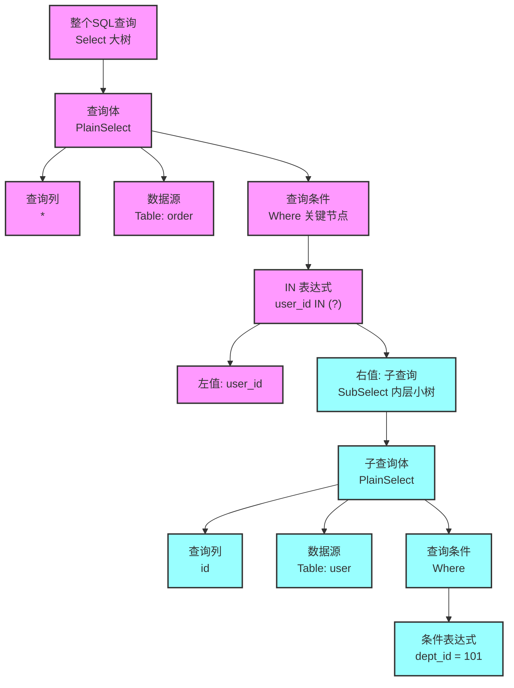

---
tags:
  - Areas/开发/基础原理
  - Areas/开发/javaWeb
category: 技术或思维
status: 加工
project: "[[../../02 - Projects/后台管理系统「Ruoyi-Vue-Plus」|后台管理系统「Ruoyi-Vue-Plus」]]"
application: SQL解析与拼接
source:
---
>**笔记不是为了复述书本，而是为了**“存档当下的自己”。如果你的笔记里没有你的思考痕迹、痛苦经历和选择理由**，它就只是一份毫无生命力的说明书，自然无法在未来唤醒你的认知***


## 💥 核心结论 (3秒原则)

🔴 概念：将字符串形式的SQL抽象成由一块块结构化的组件（select部分、where部分...）组成的抽象语法树（AST）

🔴 核心目的：拼接SQL不再因为定位问题导致语法错误；可实现复杂SQL查询（join、子查询、union等）

## 🔪 我的见解/重构

🔴 「SQL控制用户数据权限」痛点：

1. 朴素的SQL字符串拼接方式（where条件）定位麻烦，需要索引判断where是否存在？limit是否存在？order是否存在；**JSQLParser**能够直接提供where结构，节省大量条件判断；
2. 朴素的SQL字符串拼接方式难以处理复杂查询（join、子查询等）；**JSQLParser**则可以通过树的递归遍历实现复杂查询的拼接。

🔴 底层逻辑：
- 将完整SQL拆解一个个「词语」。如`SELECT name FROM user WHERE age > 18` 会被拆成`SELECT`、`name`、`FROM`、`user`、`WHERE`、`age`、`>`、`18`。
- 按照「SQL语法规则」搭成一棵树
```
查询(Select)
├─ 要查的东西: 名字(name)
├─ 从哪查: 用户表(user)
└─ 条件(Where)
   └─ 比较(>)
      ├─ 左边: 年龄(age)
      └─ 右边: 18
```
- 再按照实际插入目标比如`where`在树中找到对应的位置并加入进去。


## ⛪ 场景设想
- **场景 A**：在处理 [XXX] 代码逻辑时可以替代原有的 [YYY] 方法。
- **场景 B**：在进行 [ZZZ] 决策时，用来规避逻辑谬误。